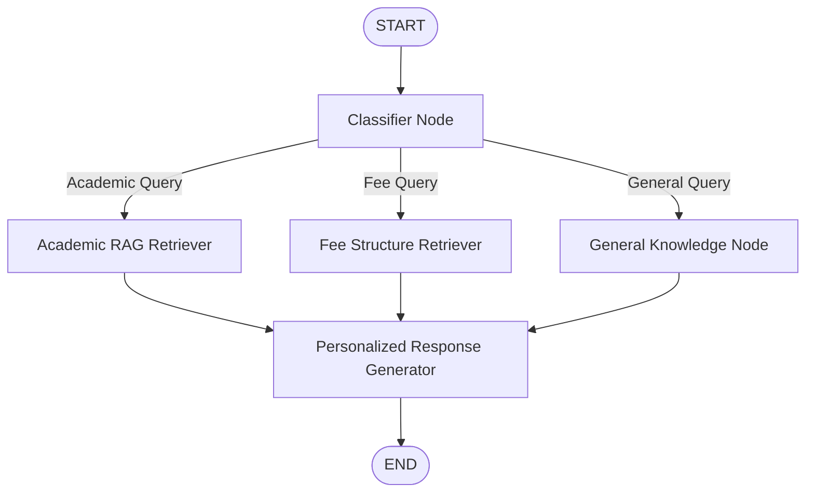
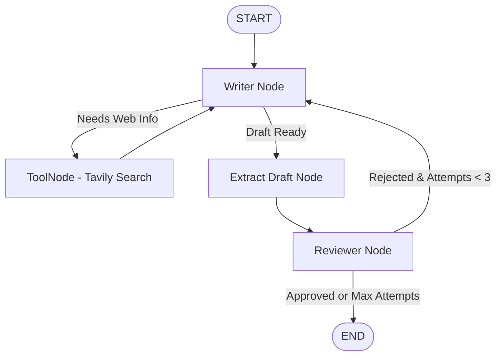
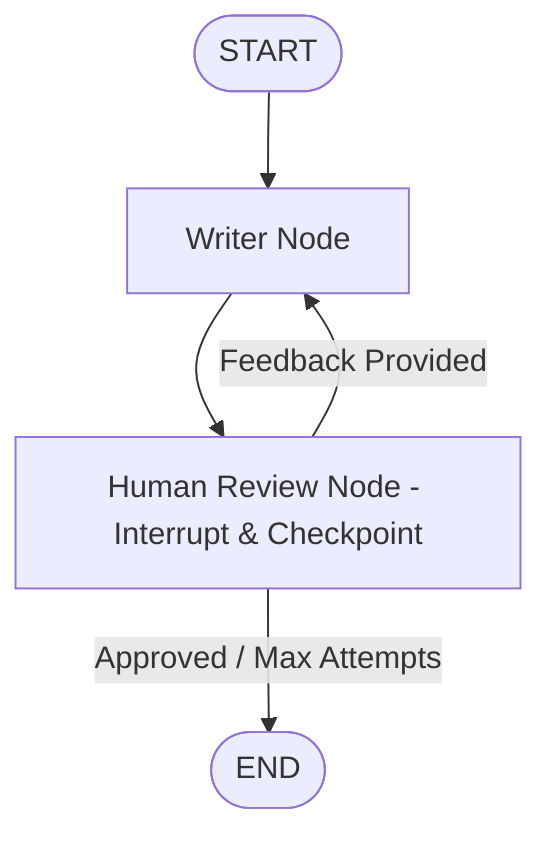
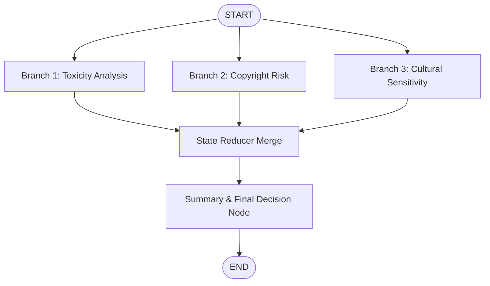

# 🚀 LangGraph Agentic Workflows & Multi-Agent Systems

A comprehensive repository demonstrating advanced **LangGraph** patterns, agentic workflows, multi-document RAG, tool calling, and human-in-the-loop systems powered by **LangChain** and **Groq LLMs**.

---

## 📌 Features & Workflows

| Script | Pattern | Description | Key Concepts |
| :--- | :--- | :--- | :--- |
| [`conditional_RAG.py`](file:///Users/aryangupta/Desktop/LangGraph/conditional_RAG.py) | **Conditional RAG** | Routes queries dynamically to academic or fee document retrievers using vector stores. | `StateGraph`, `FAISS`, `PyPDFLoader`, conditional edges |
| [`iterative_tools.py`](file:///Users/aryangupta/Desktop/LangGraph/iterative_tools.py) | **Iterative Agent + Tools** | Autonomous writer agent that calls Tavily web search, generates drafts, and refines them via an automated reviewer loop. | `bind_tools`, `ToolNode`, `TavilySearch`, cyclic graphs |
| [`humanintheloop.py`](file:///Users/aryangupta/Desktop/LangGraph/humanintheloop.py) | **Human-in-the-Loop (HITL)** | Pauses execution using checkpointer memory to wait for human review, feedback, or approval before resuming. | `MemorySaver`, `interrupt()`, `Command(resume=...)` |
| [`parallel_reducers.py`](file:///Users/aryangupta/Desktop/LangGraph/parallel_reducers.py) | **Parallel Fan-out & Reducers** | Concurrently runs multi-branch safety and risk analysis, merging scores into a unified state dict using custom reducers. | Fan-out edges, `Annotated`, custom state reducers |
| [`sequence.py`](file:///Users/aryangupta/Desktop/LangGraph/sequence.py) | **Sequential Pipeline** | 3-stage linear pipeline: Copyediting $\rightarrow$ Scriptwriting $\rightarrow$ Hinglish Localization. | Sequential nodes, state propagation |
| [`states.py`](file:///Users/aryangupta/Desktop/LangGraph/states.py) | **State Modeling** | Reference patterns for schema modeling using `TypedDict`, `Pydantic BaseModel`, and `dataclass`. | State typing, validation, schema design |

---

## 📂 Architecture Overview

### 1. Conditional RAG (`conditional_RAG.py`)


### 2. Iterative Agent with Tavily Tools & Reviewer (`iterative_tools.py`)


### 3. Human-in-the-Loop Workflow (`humanintheloop.py`)


### 4. Parallel Reducers (`parallel_reducers.py`)


---

## 🛠️ Getting Started

### 1. Clone the Repository
```bash
git clone https://github.com/yoloaryan/LangGraph.git
cd LangGraph
```

### 2. Set Up Virtual Environment & Install Dependencies
```bash
python3 -m venv .venv
source .venv/bin/activate
pip install -r requirement.txt
```

### 3. Configure API Keys
Create a `.env` file in the root directory:
```env
GROQ_API_KEY="your-groq-api-key"
TAVILY_API_KEY="your-tavily-api-key"
```

---

## 💻 Running the Workflows

### 📚 Conditional RAG
```bash
python conditional_RAG.py
```

### 🔄 Iterative Agent with Tavily Search
```bash
python iterative_tools.py
```

### 👤 Human-in-the-Loop Workflow
```bash
python humanintheloop.py
```

### ⚡ Parallel Branching & Reducers
```bash
python parallel_reducers.py
```

### 📝 Sequential Content Pipeline
```bash
python sequence.py
```

---

## 📦 Tech Stack
- **Framework:** [LangGraph](https://github.com/langchain-ai/langgraph), [LangChain](https://github.com/langchain-ai/langchain)
- **LLM Provider:** [Groq](https://groq.com/) (GPT-OSS / Llama 3)
- **Search Tool:** [Tavily AI](https://tavily.com/)
- **Embeddings & Vectorstore:** `sentence-transformers/all-MiniLM-L6-v2`, `FAISS`
- **Language:** Python 3.11+
